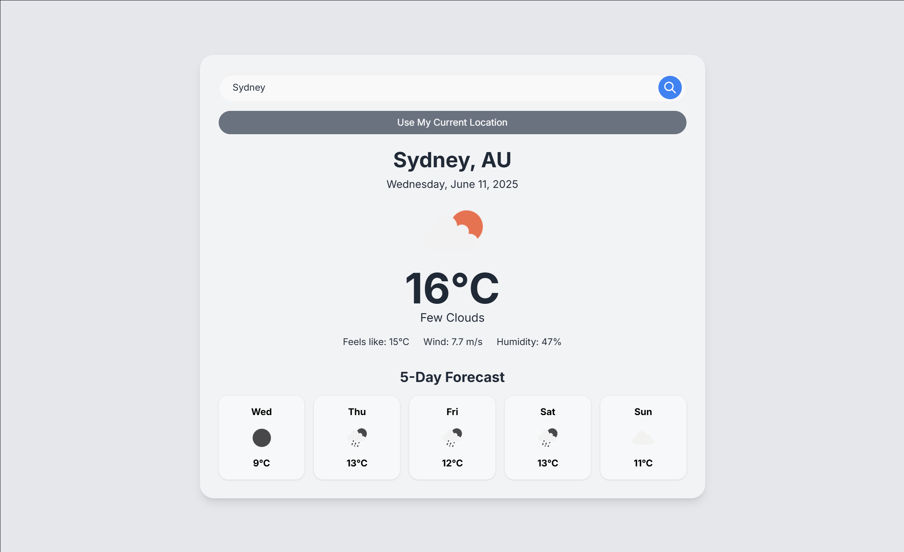

# Weather App

This is a simple web application that allows users to check the current weather and a 5-day forecast for a specific city or their current location.

## Screenshot



## Features

*   **City Search:** Users can type the name of a city in the search bar to get its weather information.
*   **Current Location Weather:** Users can click a button to allow the browser to use their current location and display local weather.
*   **Current Weather Details:** Displays:
    *   City name and country code.
    *   Current date.
    *   Weather icon representing the current conditions.
    *   Current temperature in Celsius.
    *   "Feels like" temperature in Celsius.
    *   Wind speed (m/s).
    *   Humidity percentage.
    *   A textual description of the weather conditions (e.g., "clear sky", "light rain").
*   **5-Day Forecast:** Shows a 5-day weather forecast, including:
    *   Day of the week (abbreviated).
    *   Weather icon for the forecasted day.
    *   Forecasted temperature in Celsius for midday.
*   **User Feedback:** Displays error messages if a city is not found, if geolocation services are unavailable or denied, or if there's an API error.

## Setup and Usage

1.  **Clone or download the repository.**
2.  **Get an API Key:** This application uses the [OpenWeatherMap API](https://openweathermap.org/api) to fetch weather data. You will need to sign up on their website and get a free API key.
3.  **Update API Key:** Open the `index.html` file and find the following line:
    ```javascript
    const apiKey = '67cc12742121280228988d04fc6f199d'; // IMPORTANT: Replace with your OpenWeatherMap API key
    ```
    Replace `'67cc12742121280228988d04fc6f199d'` with your actual OpenWeatherMap API key.
4.  **Open in Browser:** Simply open the `index.html` file in your web browser to use the application.

## Technologies Used

*   **HTML:** For the basic structure of the web page.
*   **Tailwind CSS:** For styling the user interface.
*   **JavaScript:** For application logic, API interaction, and DOM manipulation.
*   **OpenWeatherMap API:** To fetch current weather data and forecasts.
